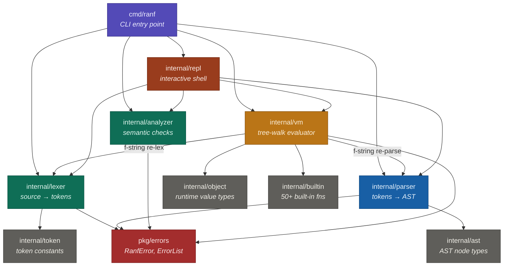
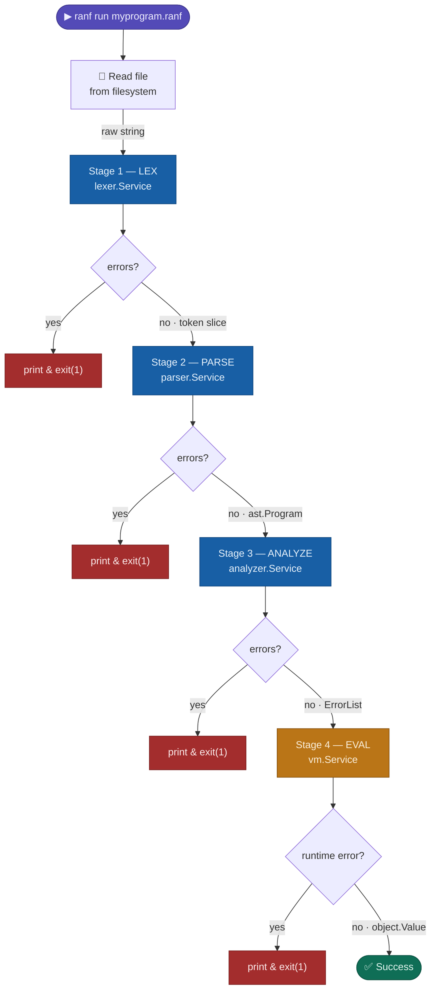
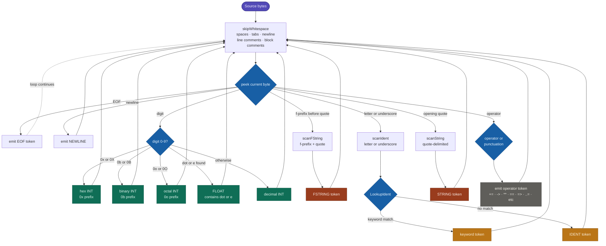
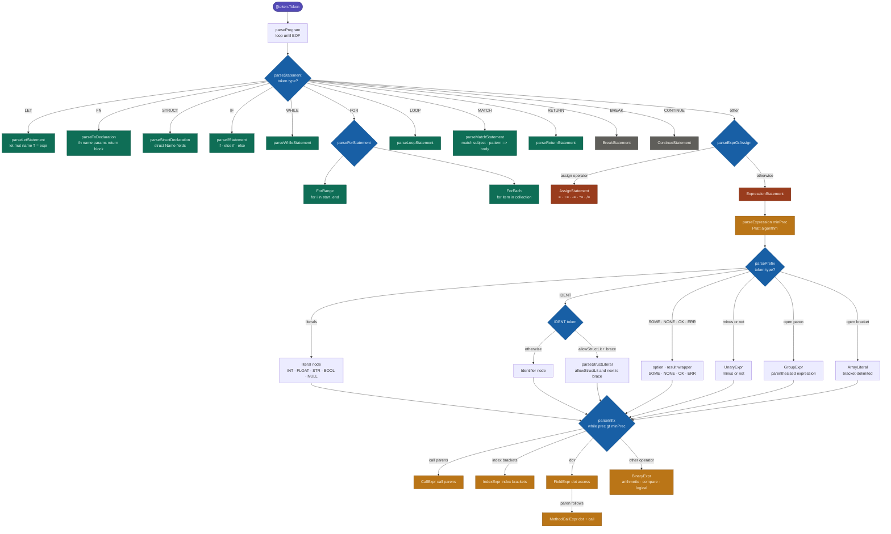
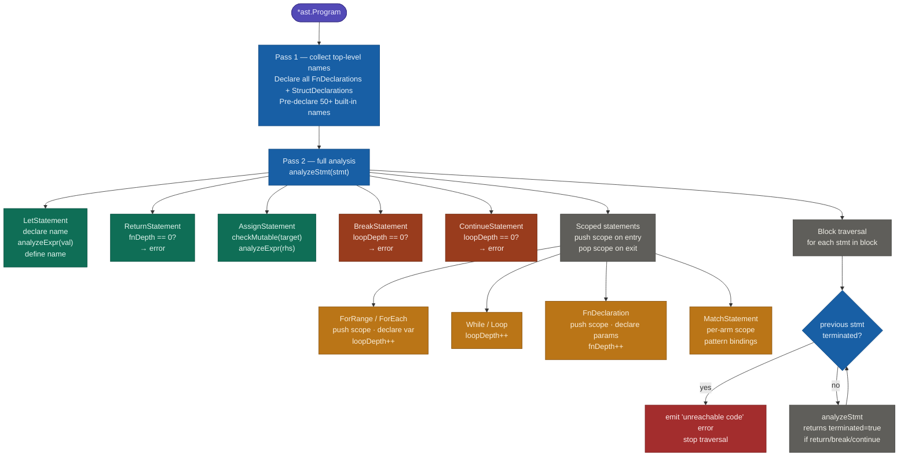
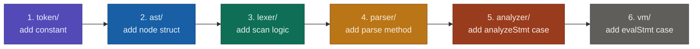

# ranf

> A Rust-inspired, safe, expressive programming language — built on Go.

[](https://github.com/risqinf/ranf/actions)
[](https://golang.org)
[](LICENSE)
[](https://www.rust-lang.org)

---

## Table of Contents

1. [Overview](#overview)
2. [Architecture](#architecture)
3. [Pipeline Flowchart](#pipeline-flowchart)
4. [Lexer Flowchart](#lexer-flowchart)
5. [Parser Flowchart](#parser-flowchart)
6. [Analyzer Flowchart](#analyzer-flowchart)
7. [VM / Evaluator Flowchart](#vm--evaluator-flowchart)
8. [Language Reference](#language-reference)
9. [Built-in Functions](#built-in-functions)
10. [Quick Start](#quick-start)
11. [CLI Reference](#cli-reference)
12. [Examples](#examples)
13. [Extending ranf](#extending-ranf)
14. [Contributing](#contributing)

---

## Overview

**ranf** is a dynamically-typed scripting language with Rust-inspired syntax and first-class safety primitives — built entirely on Go.

| Property | Description |
|---|---|
| **Immutable by default** | `let x = 5` cannot be reassigned; use `let mut x = 5` |
| **Option / Result types** | `None`, `Some(v)`, `Ok(v)`, `Err(e)` are first-class values |
| **Pattern matching** | `match` with destructuring, range patterns, wildcard |
| **f-strings** | `f"Hello {name}!"` with arbitrary inline expressions |
| **Rust-like syntax** | `fn`, `struct`, `->`, `=>`, `..`, `..=`, `**` |
| **Zero runtime panics** | type errors surface as `Err` values, not crashes |

---

## Architecture

ranf follows a **microservice pipeline architecture**. Each compilation stage is an independent `Service` struct with a single public method. Stages communicate through typed interfaces — never shared mutable state.

### Package Map

```
github.com/risqinf/ranf/
│
├── cmd/ranf/            CLI entry point (main.go)
│
├── internal/
│   ├── token/           Token type constants, precedence table
│   ├── lexer/           Lexer service  — source text → []token.Token
│   ├── ast/             All AST node types (Statement, Expression)
│   ├── parser/          Parser service — []token.Token → *ast.Program
│   ├── analyzer/        Analyzer service — *ast.Program → ErrorList
│   ├── object/          Runtime value types + Environment (scopes)
│   ├── builtin/         Built-in function registry (50+ functions)
│   ├── vm/              VM / evaluator service — *ast.Program → object.Value
│   └── repl/            Interactive REPL service
│
└── pkg/
    └── errors/          Shared structured error type (RanfError, ErrorList)
```

### Dependency Graph



---

## Pipeline Flowchart



---

## Lexer Flowchart

The lexer transforms raw UTF-8 source text into a flat `[]token.Token` stream, tracking line and column numbers for every token.



---

## Parser Flowchart

The parser uses **Pratt (top-down operator precedence)** for expressions and **recursive descent** for statements.



### Operator Precedence Table

| Level | Precedence | Operators |
|:---:|:---|:---|
| 15 | `FIELD` | `.` |
| 14 | `INDEX` | `[]` |
| 13 | `CALL` | `()` |
| 12 | `UNARY` | `! -` *(prefix only)* |
| 11 | `POWER` | `**` *(right-associative)* |
| 10 | `PRODUCT` | `* / %` |
| 9 | `SUM` | `+ -` |
| 8 | `SHIFT` | `<< >>` |
| 7 | `BITWISE` | `& \| ^` |
| 6 | `COMPARISON` | `< > <= >=` |
| 5 | `EQUALITY` | `== !=` |
| 4 | `AND` | `&&` |
| 3 | `OR` | `\|\|` |
| 2 | `ASSIGN` | `=` |
| 1 | `LOWEST` | *(base)* |

---

## Analyzer Flowchart

The analyzer performs semantic checks in **two passes**.



---

## VM / Evaluator Flowchart

The VM is a **tree-walking evaluator** — it recursively walks the AST and produces a runtime `object.Value` for each node.

```mermaid
flowchart TD
    PROG(["vm.Service.Run(program, env)"])
    STMT2{"evalStmt(stmt, env)\nstatement type?"}

    LET3["LetStatement\nevalExpr(value)\nenv.Define(name, val, mutable)"]

    ASSIGN3{"AssignStatement\nevalExpr(rhs)"}
    IDENT3["Identifier → env.Set(name, val)"]
    IDX3["IndexExpr → arr.Elements[i] = val"]
    FIELD3["FieldExpr → struct.Fields[f] = val"]

    SIG["Control signals\nReturn · Break · Continue"]
    RETSIG["ReturnSignal\nbubbles to applyFunction"]
    BRKSIG["BreakSignal\nbubbles to loop handler"]
    CONTSIG["ContinueSignal\ntriggers next iteration"]

    IF3["IfStatement\nevalExpr(cond).Truthy()\n→ evalBlock(consequence/alternative)"]
    WHILE3["WhileStatement\nloop: cond.Truthy()\n→ evalBlock(body)"]
    FOR_R["ForRange\nfor i = start; i < end; i++\n→ evalBlock(body)"]
    FOR_E["ForEach\nevalExpr(collection) → []Value\n→ evalBlock per element"]
    FN3["FnDeclaration\nFunction{params, body, closure=env}\nenv.Define(name, fn)"]
    MATCH3["MatchStatement\nevalExpr(subject)\nfor each arm: matchPattern?"]
    MATCH_Y["yes → evalStmt(body, armEnv)\nstop"]
    MATCH_N["no → next arm"]

    EXPR2["evalExpr(expr, env)"]
    LIT2["Literals\nobject.Int / Float / Str / Bool / Null"]
    IDENT2["Identifier\nenv.Get(name) OR builtins.Get(name)"]
    UNARY2["UnaryExpr\nevalExpr(right) → apply - or !"]
    BIN2{"BinaryExpr"}
    AND2["&& short-circuit\nleft falsy → false"]
    OR2["|| short-circuit\nleft truthy → true"]
    BINOP["evalLeft, evalRight\n→ applyBinaryOp"]
    CALL2{"CallExpr\neval callee"}
    BUILTIN["Builtin → fn.Fn(args)"]
    USERFN["Function\npush closure env\nbind params\nevalBlock(body)\nunwrap ReturnSignal"]
    METHOD2["MethodCallExpr\neval object\n→ applyMethod(obj, method, args)"]
    INDEX2["IndexExpr\narray[int] or str[int]"]
    FEXPR["FieldExpr\nstructInstance.Fields[field]"]
    FSTR2["FStringLiteral\nfor each Part:\ntext → as-is\nexpr → re-lex → re-parse → eval → Inspect()"]

    PROG -->|for each stmt| STMT2
    STMT2 --> LET3
    STMT2 --> ASSIGN3
    ASSIGN3 --> IDENT3
    ASSIGN3 --> IDX3
    ASSIGN3 --> FIELD3
    STMT2 --> SIG
    SIG --> RETSIG
    SIG --> BRKSIG
    SIG --> CONTSIG
    STMT2 --> IF3
    STMT2 --> WHILE3
    STMT2 --> FOR_R
    STMT2 --> FOR_E
    STMT2 --> FN3
    STMT2 --> MATCH3
    MATCH3 --> MATCH_Y
    MATCH3 --> MATCH_N

    LET3 --> EXPR2
    IF3 --> EXPR2
    WHILE3 --> EXPR2
    FOR_R --> EXPR2
    FOR_E --> EXPR2

    EXPR2 --> LIT2
    EXPR2 --> IDENT2
    EXPR2 --> UNARY2
    EXPR2 --> BIN2
    BIN2 --> AND2
    BIN2 --> OR2
    BIN2 --> BINOP
    EXPR2 --> CALL2
    CALL2 --> BUILTIN
    CALL2 --> USERFN
    EXPR2 --> METHOD2
    EXPR2 --> INDEX2
    EXPR2 --> FEXPR
    EXPR2 --> FSTR2

    style PROG fill:#534AB7,color:#EEEDFE,stroke:#3C3489
    style STMT2 fill:#185FA5,color:#E6F1FB,stroke:#0C447C
    style ASSIGN3 fill:#185FA5,color:#E6F1FB,stroke:#0C447C
    style BIN2 fill:#185FA5,color:#E6F1FB,stroke:#0C447C
    style CALL2 fill:#185FA5,color:#E6F1FB,stroke:#0C447C
    style MATCH3 fill:#185FA5,color:#E6F1FB,stroke:#0C447C
    style LET3 fill:#0F6E56,color:#E1F5EE,stroke:#085041
    style FN3 fill:#0F6E56,color:#E1F5EE,stroke:#085041
    style IF3 fill:#0F6E56,color:#E1F5EE,stroke:#085041
    style WHILE3 fill:#0F6E56,color:#E1F5EE,stroke:#085041
    style FOR_R fill:#0F6E56,color:#E1F5EE,stroke:#085041
    style FOR_E fill:#0F6E56,color:#E1F5EE,stroke:#085041
    style IDENT3 fill:#0F6E56,color:#E1F5EE,stroke:#085041
    style IDX3 fill:#0F6E56,color:#E1F5EE,stroke:#085041
    style FIELD3 fill:#0F6E56,color:#E1F5EE,stroke:#085041
    style EXPR2 fill:#BA7517,color:#FAEEDA,stroke:#854F0B
    style BUILTIN fill:#BA7517,color:#FAEEDA,stroke:#854F0B
    style USERFN fill:#BA7517,color:#FAEEDA,stroke:#854F0B
    style BINOP fill:#BA7517,color:#FAEEDA,stroke:#854F0B
    style AND2 fill:#5F5E5A,color:#F1EFE8,stroke:#444441
    style OR2 fill:#5F5E5A,color:#F1EFE8,stroke:#444441
    style RETSIG fill:#993C1D,color:#FAECE7,stroke:#712B13
    style BRKSIG fill:#993C1D,color:#FAECE7,stroke:#712B13
    style CONTSIG fill:#993C1D,color:#FAECE7,stroke:#712B13
    style FSTR2 fill:#993C1D,color:#FAECE7,stroke:#712B13
    style MATCH_Y fill:#0F6E56,color:#E1F5EE,stroke:#085041
    style MATCH_N fill:#5F5E5A,color:#F1EFE8,stroke:#444441
```



---

## Language Reference

### Variables & Types

```ranf
// Immutable (default) — cannot be reassigned
let name = "Alice"
let pi: float = 3.14159

// Mutable — declare with 'mut'
let mut score = 0
score += 10

// Numeric literals
let hex    = 0xFF        // 255
let binary = 0b1010      // 10
let octal  = 0o17        // 15
let big    = 1_000_000   // readable separators
```

**Built-in types:**

| Type | Example | Notes |
|---|---|---|
| `int` | `42`, `-7`, `0xFF` | 64-bit signed integer |
| `float` | `3.14`, `1e10` | 64-bit IEEE-754 |
| `str` | `"hello"` | UTF-8 string |
| `bool` | `true`, `false` | |
| `null` | `null` | absence of value |
| `array` | `[1, 2, 3]` | ordered, heterogeneous |
| `struct` | `Point { x: 1 }` | user-defined record |
| `Option<T>` | `Some(v)`, `None` | safe nullable |
| `Result<T,E>` | `Ok(v)`, `Err(e)` | safe error handling |

### Control Flow

```ranf
// if / else if / else
if score >= 90 {
    println("A")
} else if score >= 80 {
    println("B")
} else {
    println("F")
}

// for range (exclusive / inclusive)
for i in 0..10  { println(i) }
for i in 1..=10 { println(i) }

// for each
let items = ["a", "b", "c"]
for item in items { println(item) }

// loop + break / continue
let mut n = 0
loop {
    n += 1
    if n >= 5 { break }
}
```

### Functions

```ranf
fn add(a: int, b: int) -> int {
    return a + b
}

fn divide(a: int, b: int) -> Result<int> {
    if b == 0 { return Err("division by zero") }
    return Ok(a / b)
}

fn factorial(n: int) -> int {
    if n <= 1 { return 1 }
    return n * factorial(n - 1)
}
```

### Structs

```ranf
struct Point {
    x: int,
    y: int,
}

let p = Point { x: 10, y: 20 }
println(p.x)   // 10

let mut origin = Point { x: 0, y: 0 }
origin.x = 5
```

### Option & Result

```ranf
fn safe_head(arr: array) -> Option<int> {
    if len(arr) == 0 { return None }
    return Some(arr[0])
}

match safe_head([1, 2, 3]) {
    Some(v) => println(f"first = {v}"),
    None    => println("empty array"),
}

// Unwrap helpers
println(Some(42).unwrap())       // 42
println(None.unwrap_or(99))      // 99
```

### Match

```ranf
match x {
    0       => println("zero"),
    1       => println("one"),
    2..=9   => println("single digit"),
    10..=99 => println("two digits"),
    _       => println("large"),
}

match read_file("data.txt") {
    Ok(content) => println(content),
    Err(e)      => println(f"error: {e}"),
}
```

### f-Strings

```ranf
let name = "Alice"
let age  = 30

println(f"Name: {name}, Age: {age}")
println(f"Next year: {age + 1}")
println(f"Uppercase: {upper(name)}")
```

### Operators

```ranf
// Arithmetic          +  -  *  /  %  ** (power)
// Comparison          ==  !=  <  >  <=  >=
// Logical             &&  ||  !
// Bitwise             &  |  ^  <<  >>
// Compound assign     +=  -=  *=  /=
// String concat       "hello" + " world"
```

---

## Built-in Functions

### I/O

| Function | Description |
|---|---|
| `print(...)` | Print to stdout without newline |
| `println(...)` | Print to stdout with newline |
| `eprintln(...)` | Print to stderr with newline |
| `input(prompt)` | Read a line from stdin |

### Conversion

| Function | Description |
|---|---|
| `int(v)` | Convert to integer |
| `float(v)` | Convert to float |
| `str(v)` | Convert to string |
| `bool(v)` | Convert to boolean |

### Math

| Function | Description |
|---|---|
| `abs(n)` | Absolute value |
| `sqrt(n)` | Square root |
| `pow(base, exp)` | Exponentiation |
| `floor(n)` / `ceil(n)` / `round(n)` | Rounding |
| `min(a, b, ...)` / `max(a, b, ...)` | Extremes |
| `clamp(v, lo, hi)` | Clamp v to [lo, hi] |

### String

| Function | Description |
|---|---|
| `len(s)` | Character count |
| `chars(s)` | Array of single-character strings |
| `trim(s)` | Remove leading/trailing whitespace |
| `split(s, sep)` / `join(arr, sep)` | Split / join |
| `upper(s)` / `lower(s)` | Case conversion |
| `contains(s, sub)` | Substring check |
| `starts_with(s, p)` / `ends_with(s, p)` | Prefix / suffix |
| `replace(s, old, new)` | Replace all occurrences |
| `repeat(s, n)` | Repeat string n times |

**String methods:**

```ranf
"hello".upper()          // "HELLO"
"hello".contains("ell")  // true
"a,b,c".split(",")       // ["a","b","c"]
"42".parse_int()         // Ok(42)
"3.14".parse_float()     // Ok(3.14)
```

### Array

| Function | Description |
|---|---|
| `len(arr)` | Element count |
| `push(arr, v)` | New array with v appended |
| `pop(arr)` | Last element |
| `insert(arr, i, v)` / `remove(arr, i)` | Insert / remove |
| `first(arr)` / `last(arr)` | `Some(v)` or `None` |
| `rest(arr)` | Array without first element |
| `reverse(arr)` | Reversed array |
| `contains(arr, v)` | Membership check |
| `range(n)` / `range(s, e)` / `range(s, e, step)` | Range generation |

### Type Checks & Unwrap

| Function | Description |
|---|---|
| `type_of(v)` | Returns type name as string |
| `is_some(v)` / `is_none(v)` | Option checks |
| `is_ok(v)` / `is_err(v)` | Result checks |
| `unwrap(v)` | Extract value from Some/Ok |
| `unwrap_or(v, default)` | Extract or return default |
| `unwrap_err(v)` | Extract error from Err |

### Assertion

| Function | Description |
|---|---|
| `assert(cond, msg?)` | Panic if cond is false |
| `assert_eq(a, b)` | Panic if a != b |
| `panic(msg)` | Unconditional panic |
| `exit(code?)` | Exit with status code |

---

## Quick Start

### Prerequisites

- Go **1.25.8** or later
- `go` in your `PATH`

### Install from Source

```bash
git clone https://github.com/risqinf/ranf.git
cd ranf
go build -o ranf ./cmd/ranf

# Optional: install to $GOPATH/bin
go install ./cmd/ranf
```

### Hello World

```bash
echo 'println("Hello, World!")' > hello.ranf
./ranf run hello.ranf
# Hello, World!
```

---

## CLI Reference

```
Usage:
  ranf run   <file.ranf>   Execute a ranf source file
  ranf check <file.ranf>   Check syntax and semantics without running
  ranf repl                Start the interactive REPL
  ranf version             Print version information
  ranf help                Print usage

Shortcut:
  ranf <file.ranf>         Same as 'ranf run <file.ranf>'
```

### REPL Commands

```
ranf> :help    — show available commands
ranf> :quit    — exit
ranf> :clear   — reset the environment
```

---

## Examples

All examples are in the `examples/` directory:

| File | Demonstrates |
|---|---|
| `01_hello.ranf` | Hello World, basic I/O, f-strings |
| `02_variables.ranf` | Variables, mutability, numeric literals |
| `03_control_flow.ranf` | if/else, while, for, loop, match |
| `04_functions.ranf` | Functions, recursion, higher-order patterns |
| `05_option_result.ranf` | Option\<T\>, Result\<T,E\>, safe error handling |
| `06_structs.ranf` | Struct definitions, field access |
| `07_arrays.ranf` | Arrays, built-in operations, iteration |
| `08_strings.ranf` | String operations, f-strings, methods |
| `09_advanced.ranf` | Stack, binary search, FizzBuzz combined |

```bash
make run-examples
```

---

## Extending ranf

### Adding a New Built-in Function

Edit `internal/builtin/builtin.go`:

```go
// 1. Implement the function
var builtinMyFn object.BuiltinFn = func(args []object.Value) (object.Value, error) {
    if err := checkArity("my_fn", 1, args); err != nil {
        return nil, err
    }
    return &object.Str{V: "result"}, nil
}

// 2. Register it
r.add("my_fn", builtinMyFn)
```

Also add the name to `builtinNames` in `internal/analyzer/analyzer.go`.

### Adding a New Syntax Construct

Each step is fully isolated — changes in one stage never affect another:



### Replacing the Evaluator

The `vm.Service` interface is intentionally minimal:

```go
func (s *Service) Run(prog *ast.Program, env *object.Environment) (object.Value, *errors.RanfError)
```

To swap in a bytecode compiler + VM, implement two new services and wire them in `cmd/ranf/main.go` — the lexer, parser, and analyzer remain unchanged.

---

## Contributing

```bash
# Fork and clone
git clone https://github.com/YOUR_USERNAME/ranf.git

# Run tests
make test

# Format code
make fmt

# Check examples still pass
make check-examples && make run-examples
```

All commits should:
- Pass `go vet ./...`
- Pass `gofmt -s -l .` (no formatting differences)
- Include a test for any new language feature

---

## License

MIT — see [LICENSE](LICENSE)

---

*ranf is built on Go and inspired by Rust's safety philosophy — without Rust's complexity.*
